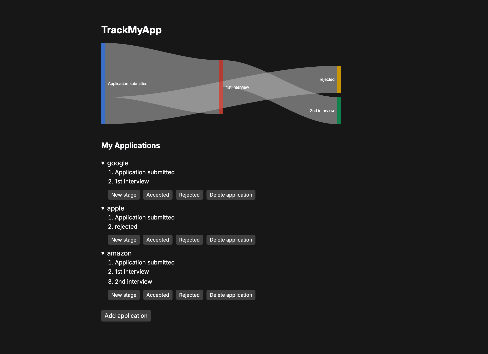

# TrackMyApp

[TrackMyApp](https://trackmyapp.info) is a simple web app I made to track and visualize concurrent (job) applications.

## Prerequisites

- Node.js v22

## Running Locally

1. `npm install`
2. `npm run dev`

## Building and Deploying

1. `npm run build`
2. `npm start`

TrackMyApp should now be running on localhost:3000.
Put a reverse proxy like nginx in front, and you are good to go.

### Deploying to Fly

The public instance is deployed on [https://fly.io].
Using the `fly.toml` provided, You should be able to run `fly deploy` on your machine and deploy it to your Fly account, provided that you are logged in.
